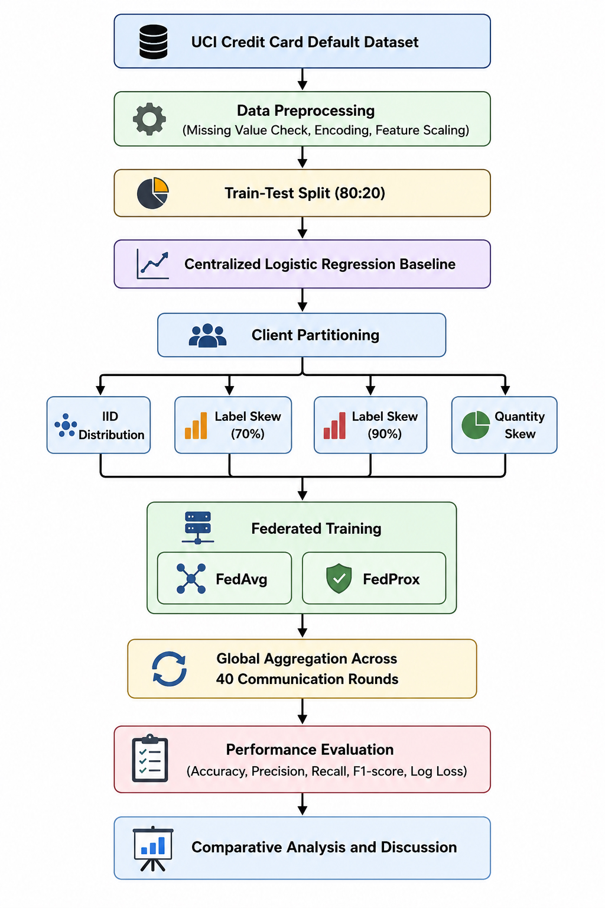

# Performance Analysis of Federated Learning under Non-IID Financial Tabular Data Distributions

## Overview

This repository contains the implementation, experimental analysis, dissertation report, and presentation for an M.Tech Major Research Project investigating the impact of Non-IID data distributions on Federated Learning performance for financial risk prediction.

The study evaluates the robustness of Federated Learning under different client data heterogeneity scenarios using the UCI Credit Card Default Dataset. Experimental comparisons are conducted between Centralized Learning, FedAvg, and FedProx under IID and Non-IID distributions.

## Research Objectives

The primary objectives of this study were:

- To establish a centralized learning baseline for credit risk prediction.
- To evaluate Federated Learning performance under IID client data distributions.
- To investigate the impact of label skew and quantity skew on Federated Learning.
- To compare the performance of FedAvg and FedProx under heterogeneous data conditions.
- To analyze the suitability of Federated Learning for privacy-preserving financial risk assessment.

## Experimental Setup

### Dataset

- UCI Credit Card Default Dataset
- 30,000 customer records
- Binary classification task (Default / No Default)

### Learning Approaches

- Centralized Logistic Regression
- Federated Averaging (FedAvg)
- Federated Proximal Optimization (FedProx)

### Experimental Scenarios

| Scenario | Algorithm |
|-----------|-----------|
| Centralized Baseline | Logistic Regression |
| IID Distribution | FedAvg |
| Label Skew (70%) | FedAvg, FedProx |
| Label Skew (90%) | FedAvg, FedProx |
| Quantity Skew | FedAvg |

### Evaluation Metrics

- Accuracy
- Precision
- Recall
- F1-score
- Log Loss

## Key Findings

The experimental analysis led to the following observations:

- Federated Learning achieved performance close to centralized learning under IID client distributions.
- Label skew introduced significant performance degradation due to statistical heterogeneity across clients.
- Severe label skew (90%) resulted in the largest reduction in predictive performance.
- Quantity skew had a comparatively smaller impact on model convergence and classification accuracy.
- FedProx demonstrated greater robustness than FedAvg under highly heterogeneous client distributions.
- The results highlight the importance of handling Non-IID data when deploying Federated Learning systems in financial environments.

### Performance Summary

| Scenario | Best Accuracy |
|-----------|-----------|
| Centralized Learning | 80.72% |
| IID Federated Learning | 80.80% |
| Label Skew (70%) - FedAvg | 66.93% |
| Label Skew (70%) - FedProx | 67.02% |
| Label Skew (90%) - FedAvg | 64.38% |
| Label Skew (90%) - FedProx | 64.78% |
| Quantity Skew - FedAvg | 80.80% |
